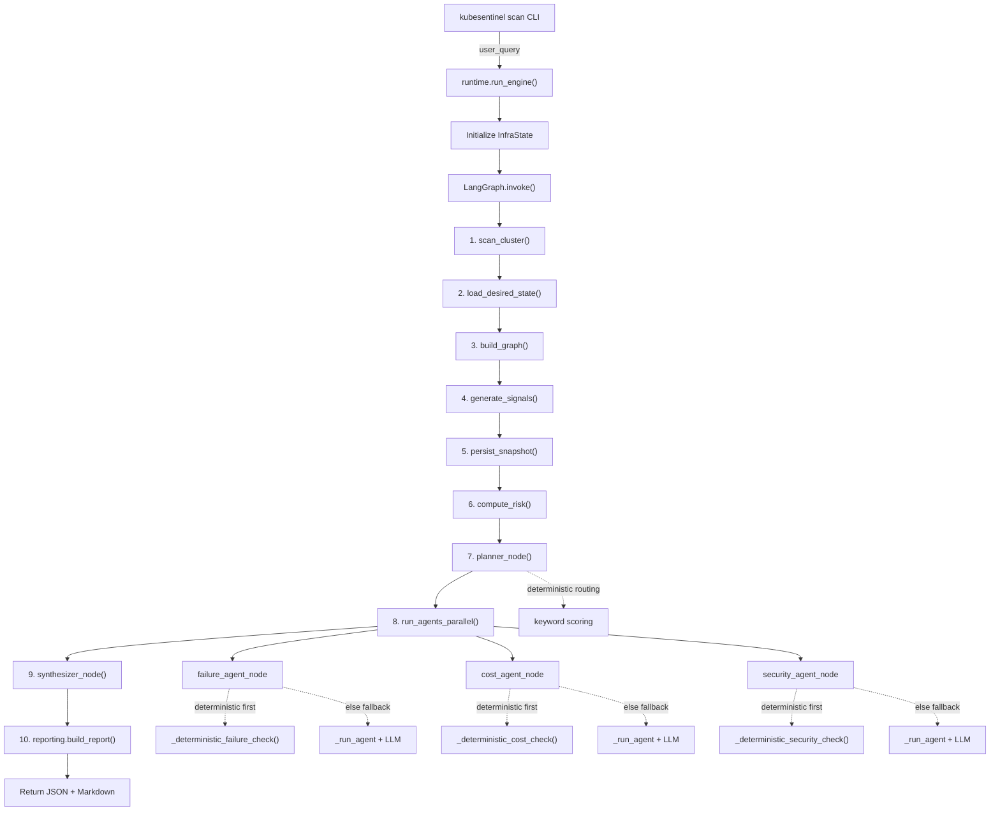
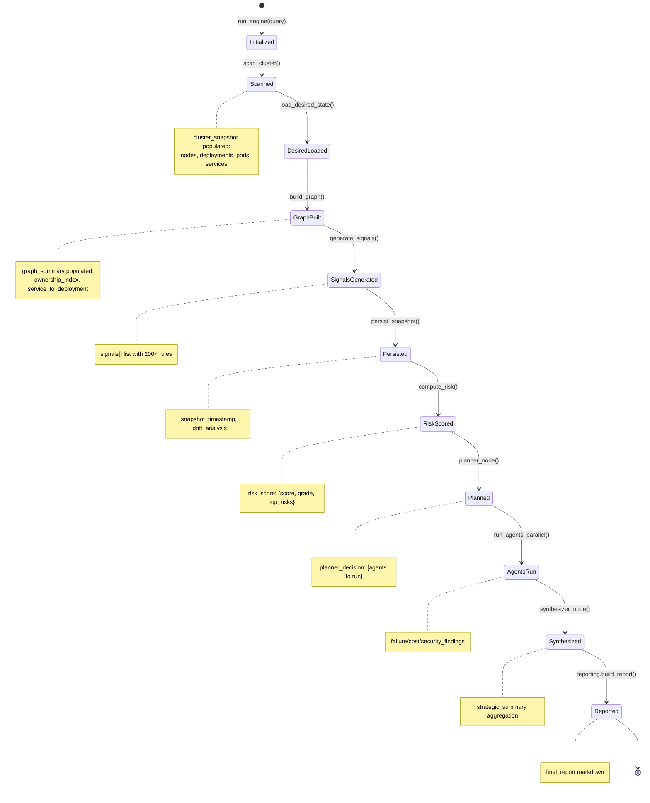
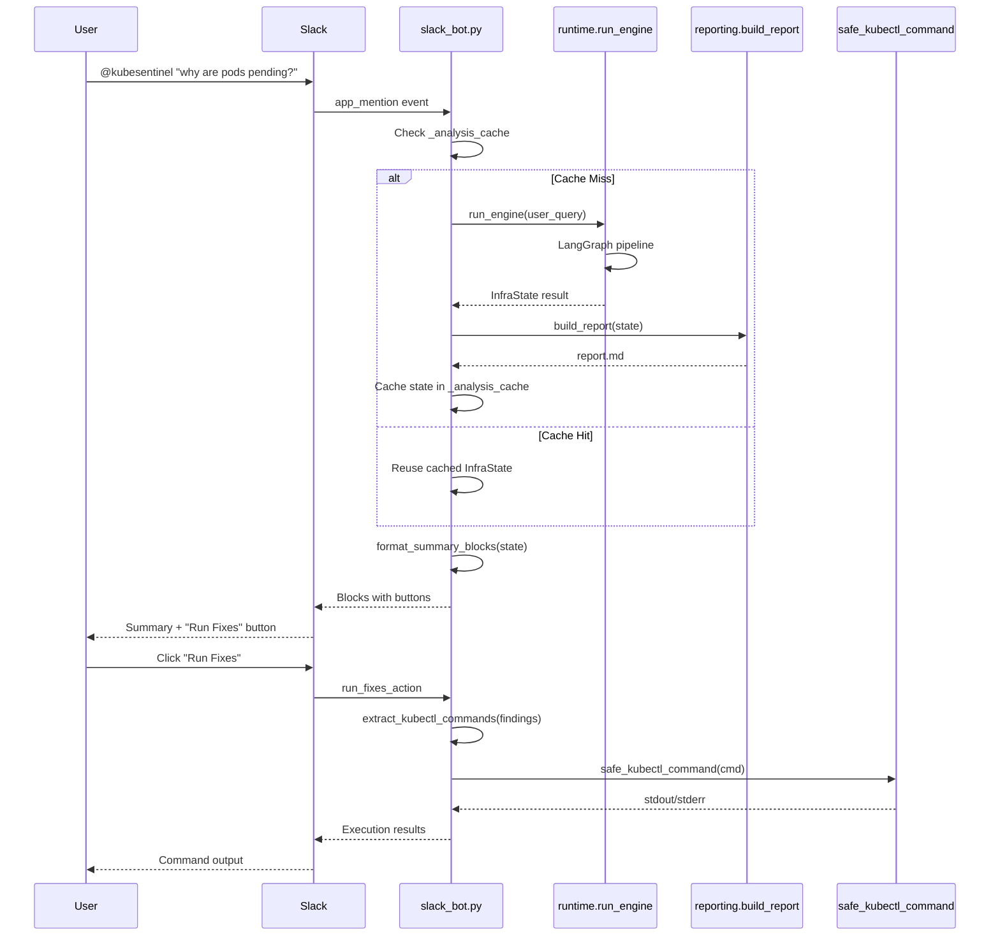

# KubeSentinel Architecture

**Status**: Production-Ready (Phase 4 Complete)  
**Last Updated**: March 2026  
**Test Coverage**: 54/54 tests passing  

---

## 1. System Overview

KubeSentinel is a deterministic-first Kubernetes cluster analysis engine that uses a LangGraph-based agent orchestration system to detect reliability, security, and cost optimization issues.

### Core Capabilities

- ✅ **Cluster Scanning**: Extracts core K8s resources (Deployments, Pods, Services, StatefulSets, DaemonSets)
- ✅ **Ownership Graph**: Builds Pod → ReplicaSet → Deployment chains with broken reference detection
- ✅ **Signal Generation**: 200+ deterministic rules for reliability, security, cost, and architecture
- ✅ **Risk Scoring**: Weighted scoring (critical=15, high=8, medium=3, low=1) with adaptive normalization
- ✅ **Query-Aware Planner**: Routes queries (cost/security/reliability/architecture) to appropriate agents
- ✅ **Parallel Agent Execution**: Cost, Security, and Failure analysis agents run concurrently
- ✅ **Node Failure Simulation**: "What-if" analysis for node failure impact assessment
- ✅ **Persistence & Drift Detection**: SQLite-backed state tracking with drift classification
- ✅ **Slack Integration**: Real-time cluster monitoring with interactive remediation in Slack

---

## 2. Agent Execution Pipeline



**Key Characteristics**:
- Pipeline is compiled as a LangGraph in `runtime.py:build_runtime_graph()`
- Deterministic checks execute first, LLM serves as fallback
- Agents run in parallel via ThreadPoolExecutor (max 3 workers)
- State flows sequentially through typed nodes (InfraState objects)
- Full execution tracing with automatic runtime graph visualization

---

## 3. Data Flow & State Pipeline

```
┌─────────────────────────────────────────────────────────┐
│                   User Query                             │
│          (e.g., "reduce costs", "security audit")        │
└────────────────────────┬────────────────────────────────┘
                         │
    ┌────────────────────▼────────────────────┐
    │      1. CLUSTER SCANNER (cluster.py)    │
    │   - Load kubeconfig or in-cluster auth  │
    │   - Extract: Pods, Deployments,         │
    │     StatefulSets, DaemonSets, Services  │
    │   - Normalize: CPU (mCores), Mem (MiB)  │
    │   - Bounded: Max 1000 pods, 200 deps    │
    └────────────────┬─────────────────────────┘
                     │ cluster_snapshot
    ┌────────────────▼────────────────────┐
    │    2. GRAPH BUILDER (graph_builder) │
    │   - Pod ownership chains             │
    │   - Service→Deployment mapping       │
    │   - Broken reference detection       │
    │   - Single replica identification    │
    │   - Node fanout metrics              │
    └────────────────┬─────────────────────┘
                     │ graph_summary
    ┌────────────────▼────────────────────┐
    │  3. SIGNAL GENERATOR (signals.py)   │
    │   - 200+ deterministic rules         │
    │   - Categories: reliability, cost,   │
    │     security, architecture           │
    │   - CIS Benchmark mappings           │
    │   - Deduplication & cap (200 max)    │
    └────────────────┬─────────────────────┘
                     │ signals[]
    ┌────────────────▼────────────────────┐
    │   4. RISK SCORER (risk.py)          │
    │   - Severity weighted scoring        │
    │   - Category multipliers             │
    │   - Adaptive normalization           │
    │   - Grade: A-F                       │
    │   - Output: 0-100 score              │
    └────────────────┬─────────────────────┘
                     │ risk_score
    ┌────────────────▼────────────────────────────────────┐
    │         6. PARALLEL AGENTS (ThreadPoolExecutor)     │
    │   ┌─────────────┬──────────────┬────────────────┐  │
    │   │ Failure     │ Cost Agent   │ Security Agent │  │
    │   │ (Reliable)  │(Optimization)│(Security)      │  │
    │   └────┬────────┴──────┬───────┴────────┬──────┘   │
    │        │ (1) Determine first            │         │
    │        │ (2) LLM fallback               │         │
    │        │ (3) Thread-safe deepcopy       │         │
    │        └────────────────────────────────┘         │
    │   Each returns: [findings] (max 50 per agent)     │
    └────────────────┬────────────────────────────────────┘
                     │ failure/cost/security_findings
    ┌────────────────▼──────────────────────┐
    │  7. SYNTHESIZER (synthesizer.py)      │
    │   - Strategic summary from findings    │
    │   - Context-aware aggregation          │
    │   - Priority ranking                   │
    └────────────────┬───────────────────────┘
                     │ strategic_summary
    ┌────────────────▼──────────────────────┐
    │  8. REPORTER (reporting.py)            │
    │   - Markdown report generation         │
    │   - Executive summary                  │
    │   - Findings organization              │
    └────────────────┬───────────────────────┘
                     │ final_report
    ┌────────────────▼──────────────────────┐
    │         Output: JSON + Markdown        │
    │    - CI mode (JSON for automation)     │
    │    - Interactive (Markdown + Rich UI)  │
    └───────────────────────────────────────┘
```

---

## 4. Core Modules & Responsibilities

### cluster.py (400 lines)
**Purpose**: Extract bounded cluster state from Kubernetes API

- Load kubeconfig or in-cluster authentication
- Extract nodes, deployments, pods, services, replicasets, statefulsets, daemonsets
- Normalize CPU (milliCores) and memory (MiB) values
- Bounded resource extraction (max 1000 pods, 200 deployments)
- Node condition tracking (Ready, MemoryPressure, DiskPressure, PIDs)

### graph_builder.py (220 lines)
**Purpose**: Map resource dependencies and ownership chains

- Build UID→name lookup maps for all controller types
- Resolve Pod → ReplicaSet → Deployment ownership chains
- Map Services → Deployments via label selector matching
- Detect orphaned resources (missing owners)
- Calculate metrics: single replicas, node fanout, node capacity

### signals.py (400 lines)
**Purpose**: Generate 200+ deterministic signals

- **Reliability**: Pod states, node pressure, single replicas, orphaned resources
- **Security**: Privileged containers, image:latest, missing limits, RBAC misconfigurations
- **Cost**: Over-provisioning, missing resource limits, inefficient replicas, unused services
- **Architecture**: Resource relationships, dependency health, CIS Benchmark mappings
- Signal deduplication and cap enforcement (max 200)

### risk.py (180 lines)
**Purpose**: Compute risk scores and letter grades

**Algorithm**:
```
score = sum(severity_weight × category_multiplier for each signal)
normalized = score / (1 + max(0, signal_count - 5) / 20)
grade = A (0-34) | B (35-54) | C (55-74) | D (75-89) | F (90+)
```

- Severity weights: critical=15, high=8, medium=3, low=1, info=0
- Category multipliers: security=2.0, reliability=1.8, cost=0.5
- Saturation prevention: Adaptive divisor prevents excessive scaling
- Confidence metrics: signal_count, weighted_score, drift_impact

### agents.py (1200+ lines)
**Purpose**: Execute analysis agents with deterministic-first approach

**Key Functions**:
- `planner_node()` - Routes queries to appropriate agents based on keywords
- `failure_agent_node()` - Detects reliability and failure risks
- `cost_agent_node()` - Identifies cost optimization opportunities
- `security_agent_node()` - Performs security audits
- `_deterministic_*_check()` - Rules-based fallbacks (no LLM required)
- `_run_agent()` - Common LLM-powered agent execution
- `_extract_json_findings()` - Parses agent JSON output with sanitization
- `make_tools()` - Exposes cluster state to agents via tool interface

**Agent Tools**:
- `get_cluster_summary()` - Node, deployment, pod, service counts
- `get_graph_summary()` - Orphan services, single replicas, ownership health
- `get_signals(category)` - Filtered signals (up to 50)
- `get_risk_score()` - Current risk assessment with grade

### synthesizer.py (335 lines)
**Purpose**: Format agent findings into executive summaries

- Normalizes findings to standard structure
- Generates deterministic strategic summaries
- Adds remediation recommendations
- Aggregates findings into priority-ranked list
- No LLM required (fast, reliable synthesis)

### runtime.py (285 lines)
**Purpose**: Orchestrate pipeline execution with tracing

- `run_engine()` - Main entry point for cluster analysis
- `build_runtime_graph()` - Constructs LangGraph with all nodes
- `get_graph()` - Lazy-loads compiled graph
- `run_agents_parallel()` - Executes agents concurrently with timeouts
- Automatic execution tracing and visualization
- Error recovery with LLM fallbacks

### reporting.py (300+ lines)
**Purpose**: Generate markdown reports

- Executive summary with risk grade
- Organized findings sections (reliability, security, cost)
- Recommendations with remediation steps
- Structured formatting for readability
- CI/JSON output support for automation

### persistence.py (400+ lines)
**Purpose**: Persist cluster state and track changes

- SQLite3-backed snapshot storage
- Drift detection: resource changes, signal deltas, risk shifts
- Trend analysis: degrading, stable, improving
- SHA256 hashing for change detection
- Historical comparison for trend analysis

---

## 5. Query-Aware Agent Routing

**Planner Decision Logic** (agents.py:planner_node)

```
Query Keywords              → Agent(s)
──────────────────────────────────────────
"cost", "spend", "reduce"   → cost_agent only
"security", "vuln", "audit" → security_agent only
"failure", "replica", "node"→ failure_agent only
"full", "all", "complete"   → [failure_agent, cost_agent, security_agent]
──────────────────────────────────────────
<no match>                  → failure_agent (default)
```

**Keyword Groups**:
- **Architecture**: {full, all, complete, architecture, deep, comprehensive}
- **Cost**: {cost, costs, spend, reduce, save, waste, budget, optimize}
- **Security**: {security, vuln, cve, privilege, audit, rbac, pod, policy}
- **Reliability**: {failure, outage, replica, health, pressure, cpu, memory, disk, restart}
- **Node**: {node, memory, disk, capacity}

---

## 6. Deterministic-First Design Pattern

All agents follow this execution flow:

```
1. TRY Deterministic Check (rules-based)
   ├─ success → return findings
   └─ fail → continue
   
2. TRY LLM Agent (with tools)
   ├─ success → return findings
   └─ fail → continue
   
3. TRY Timeout Recovery (60 seconds)
   ├─ success → return deterministic findings
   └─ fail → fallback to defaults
   
4. RETURN empty findings (graceful degradation)
```

**Deterministic Checks** (no LLM required):
- Cost: single replica > 3, node underutilization < 30%, over-requested resources
- Security: privileged containers, image:latest usage
- Failure: CrashLoopBackOff detection, zero-replica deployments

**Benefits**:
- Prevents LLM hallucination in numeric/cost contexts
- Reduces token usage and latency
- Enables offline operation if LLM unavailable
- Provides reliable baseline for verification

---

## 7. Parallel Agent Execution

```python
with ThreadPoolExecutor(max_workers=3) as pool:
    futures = {
        "failure": pool.submit(failure_agent_node, deepcopy(state)),
        "cost": pool.submit(cost_agent_node, deepcopy(state)),
        "security": pool.submit(security_agent_node, deepcopy(state))
    }
    
    results = {}
    for key, future in futures.items():
        try:
            results[key] = future.result(timeout=60)
        except TimeoutError:
            results[key] = deterministic_fallback(state)
```

**Thread Safety**:
- Deep copy of state for each worker (no shared mutable state)
- 60-second timeout per agent
- Error recovery with deterministic fallbacks
- Maximum 3 concurrent agents

---

## 8. InfraState Lifecycle



---

## 9. Slack Integration Architecture

**Event Flow**:



**Key Features**:
- In-memory caching of analysis results (per thread timestamp)
- Follow-up keywords for cache reuse: "report", "show", "full", "details", "more", "explain"
- Safe kubectl execution with validation
- Kubectl command extraction from finding recommendations
- Rich formatting with Slack Block Kit

---

## 10. Key Design Principles

### Deterministic-First
- Rules-based analysis runs before LLM
- Prevents hallucination in cost/reliability metrics
- Reduces token usage and latency
- Signals provide facts, not conjecture

### Bounded State Growth
```python
MAX_PODS = 1000           # Prevent resource exhaustion
MAX_DEPLOYMENTS = 200
MAX_SERVICES = 200
MAX_SIGNALS = 200         # Prevent LLM context overflow
MAX_FINDINGS = 50         # Per agent
```

### Thread-Safe Parallel Execution
- Deep copy state for each thread
- Separate LLM connections per agent
- Independent tool chains

### Query-Aware Routing
- Keyword extraction from user queries
- Intelligent agent selection
- Default fallback behavior
- CLI override support

### Error Recovery with Fallbacks
```
Agents: Deterministic check → LLM fallback → Timeout → Deterministic
Result: rules-based       (if needed)      (60s)      (safe default)
```

---

## 11. Module Dependencies

```
cli (main.py/integrations/slack_bot.py)
 ├─ runtime.py
 │   ├─ cluster.py
 │   ├─ graph_builder.py
 │   ├─ signals.py
 │   ├─ risk.py
 │   ├─ agents.py (orchestration)
 │   │   ├─ models.py (InfraState)
 │   │   ├─ prompts/*.txt
 │   │   └─ simulation.py (optional)
 │   ├─ synthesizer.py
 │   ├─ reporting.py
 │   └─ persistence.py
 │
 └─ diagnostics/
      ├─ log_collector.py
      └─ error_signatures.py
```

---

## 12. Performance Characteristics

| Operation | Time | Notes |
|-----------|------|-------|
| Cluster scan | 2-5s | Depends on resource count |
| Graph building | 1s | Linear in pod/deployment count |
| Signal generation | 1s | 200+ rules, deduplicating |
| Risk scoring | 0.1s | Constant time |
| Deterministic agents | 0.5s | Rules-based, no LLM |
| LLM agents | 15-30s | Per agent, parallel |
| Report generation | 2s | Building markdown |
| **Total** | **20-45s** | Per analysis |

---

## 13. Known Limitations & Future Work

### Phase 5 (CRD Support)
- [ ] ArgoCD Applications & Projects discovery
- [ ] Istio resources (VirtualServices, DestinationRules, etc.)
- [ ] Prometheus monitoring rules
- [ ] KEDA ScaledObjects
- [ ] CertManager Certificates

### Phase 6 (Enhanced Observability)
- [ ] Real-time metrics integration
- [ ] Historical trend analysis
- [ ] Predictive failure detection
- [ ] Cost forecasting

