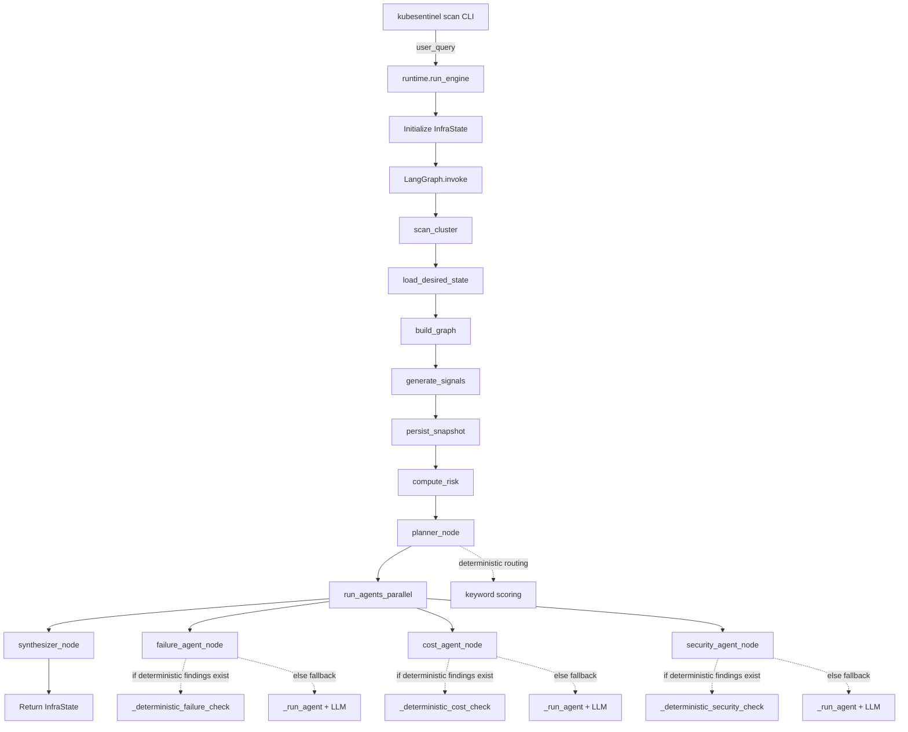
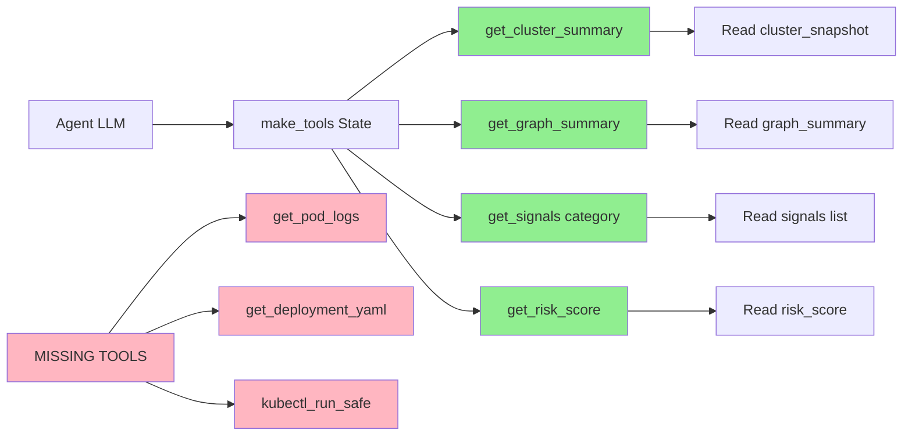
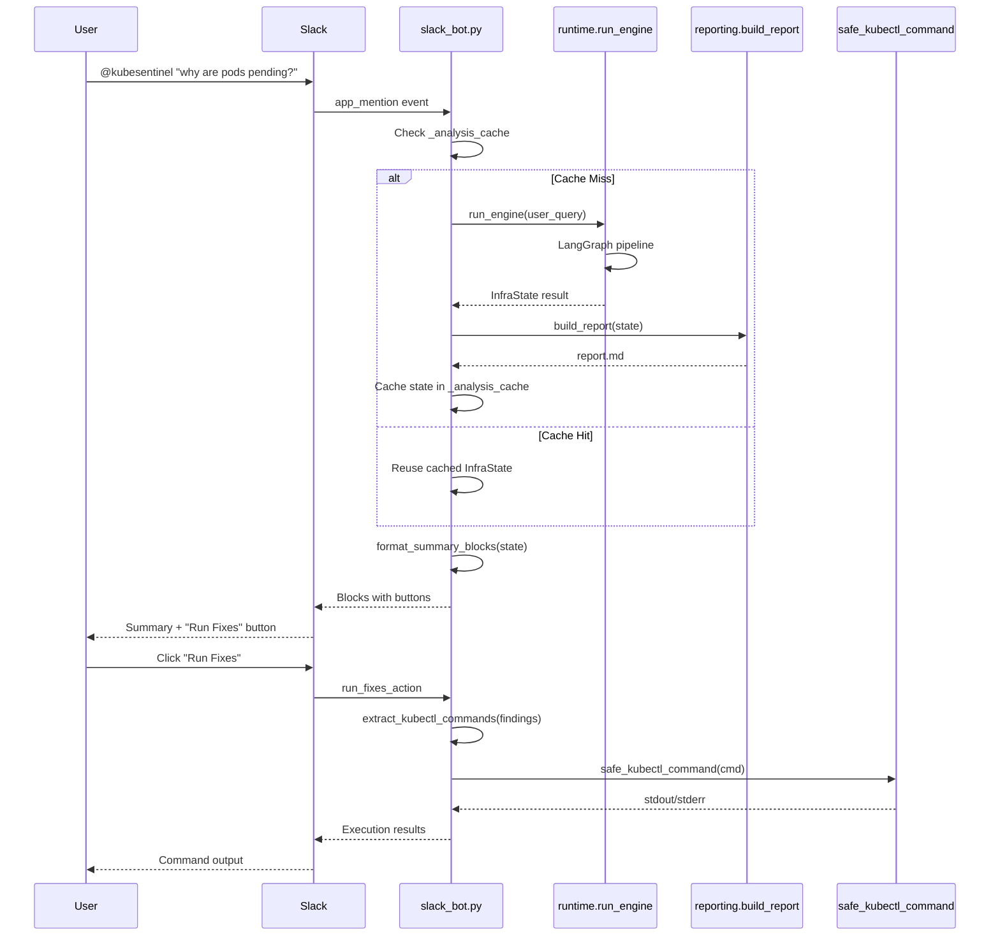
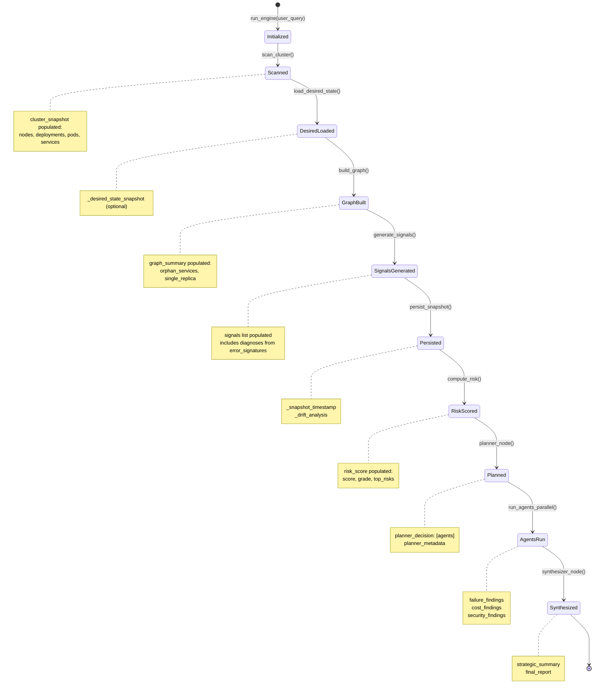

# KubeSentinel Architecture Inventory (Phase 0)

**Generated**: 2026-03-08  
**Purpose**: Document existing architecture and capabilities before implementation

---

## 1. Agent Execution Pipeline



**Key Observations**:
- Runtime graph compiled in `runtime.py:build_runtime_graph()` using LangGraph
- Deterministic checks bypass LLM when patterns detected
- Agents run in parallel via `ThreadPoolExecutor` (line 101 in runtime.py)
- State flows sequentially through pipeline nodes

---

## 2. Tool Usage Flow (CURRENT STATE)



**Existing Tools** (agents.py lines 68-136):
- ✅ `get_cluster_summary()` — returns node/deployment/pod/service counts
- ✅ `get_graph_summary()` — returns orphan services, single replicas
- ✅ `get_signals(category)` — returns filtered signals (up to 50)
- ✅ `get_risk_score()` — returns risk assessment

**Missing Tools** (Phase C will add):
- ❌ `get_pod_logs()` — needs to wrap diagnostics.fetch_pod_logs()
- ❌ `get_deployment_yaml()` — needs kubernetes.client wrapper
- ❌ `get_resource_yaml()` — needs dynamic client
- ❌ `kubectl_run_safe()` — needs safe subprocess wrapper

---

## 3. Diagnostics Capabilities (EXISTING)

### Location: `kubesentinel/diagnostics/`

**log_collector.py** (lines 10-70):
```python
def fetch_pod_logs(
    api_client: CoreV1Api,
    pod_name: str,
    namespace: str,
    container: Optional[str] = None,
    tail_lines: int = 100
) -> Optional[str]
```
- ✅ Fetches logs from crashed containers using `previous=True`
- ✅ Handles ApiException (400, 404, 403) gracefully
- ✅ Already used in cluster.py:_collect_crashloop_logs() at line 128

**error_signatures.py** (lines 1-300+):
- ✅ `diagnose_crash_logs(log_text, pod_name, namespace, container)` → DiagnosisResult
- ✅ Pattern matching for: nginx_lua_init_fail, oomkilled, python_import_error, etc.
- ✅ Returns structured diagnosis with type, root_cause, confidence, evidence, recommended_fix
- ✅ Generates fix_plan with FixStep objects

**Usage**: Currently called in signals.py during signal generation (line 100+), but NOT exposed to agents as tools

---

## 4. Kubernetes API Interaction (EXISTING)

### Location: `kubesentinel/cluster.py`

**Kubernetes Client Setup** (lines 1-30):
```python
from kubernetes import client, config
from kubernetes.client.rest import ApiException

# Uses config.load_kube_config() or config.load_incluster_config()
core_v1, apps_v1 = client.CoreV1Api(), client.AppsV1Api()
```

**API Methods Used**:
- ✅ `core_v1.list_node()` — fetch nodes
- ✅ `core_v1.list_pod_for_all_namespaces()` — fetch pods
- ✅ `core_v1.list_namespaced_pod()` — fetch pods in namespace
- ✅ `apps_v1.list_deployment_for_all_namespaces()` — fetch deployments
- ✅ `apps_v1.list_namespaced_deployment()` — fetch deployments in namespace
- ✅ `apps_v1.list_replica_set_for_all_namespaces()` — fetch replicasets
- ✅ `apps_v1.list_stateful_set_for_all_namespaces()` — fetch statefulsets
- ✅ `apps_v1.list_daemon_set_for_all_namespaces()` — fetch daemonsets
- ✅ `core_v1.list_service_for_all_namespaces()` — fetch services

**YAML Conversion**: NOT currently implemented, will need to add yaml.dump() wrapper

---

## 5. kubectl Execution (EXISTING)

### Location: `kubesentinel/integrations/slack_bot.py`

**safe_kubectl_command()** (lines 54-92):
```python
def safe_kubectl_command(command: str) -> str:
    # Current implementation:
    # - Uses command.split() (BRITTLE - needs shlex.split())
    # - Prefix matching for allowed commands (WEAK)
    # - subprocess.run(["kubectl"] + command.split(), timeout=10)
    # - Returns formatted output or error
```

**Issues Identified**:
- ❌ Uses `command.split()` instead of `shlex.split()` → fails on quoted args
- ❌ Prefix matching with `startswith()` → weak validation
- ❌ No shell metacharacter rejection
- ❌ No 2-step approval for destructive commands
- ❌ No audit logging

**Reusable**: Can extract subprocess execution logic for Phase C tool wrapper

---

## 6. Parsing & Validation (EXISTING)

### JSON Parsing (agents.py)

**_extract_json_findings()** (lines 645-720):
```python
def _extract_json_findings(result: Dict[str, Any] | None) -> List[Dict[str, Any]]:
    # Current implementation:
    # - Extracts from agent.invoke() result["output"]
    # - Sanitizes control characters
    # - Looks for markdown fences (```json)
    # - Falls back to bracketed array extraction
    # - Validates required keys: resource, severity, analysis, recommendation
    # - Returns validated findings or empty list
```

**Issues**:
- ❌ Schema mismatch: prompts require first_fix/follow_up but parser expects recommendation
- ❌ Parse failures NOT logged (just warning to console)
- ❌ No state['agent_parse_errors'] tracking

**Reusable**: Core extraction logic is solid, needs enhancement for logging

### YAML Parsing

**NOT FOUND**: No existing yaml parsing wrappers. Will need to add `import yaml` and create dumpers.

---

## 7. Persistence Layer (EXISTING)

### Location: `kubesentinel/persistence.py`

**PersistenceManager** (lines 69-300+):

**Existing Tables**:
- ✅ `snapshots` — cluster state snapshots
- ✅ `drifts` — drift detection results

**Existing Methods**:
- ✅ `save_snapshot(state: Dict) -> str` — saves full state snapshot
- ✅ `analyze_drift(current_state: Dict) -> Dict` — compares snapshots
- ✅ `get_snapshots(limit: int) -> List[Snapshot]` — retrieves history

**Missing Methods** (Phase B/G will add):
- ❌ `log_agent_output(agent_name, raw_output, snapshot_id)` — for parse failures
- ❌ `log_kubectl_execution(user_id, command, result, ...)` — for audit trail

**Missing Tables**:
- ❌ `agent_outputs` — for debugging parse failures
- ❌ `kubectl_executions` — for audit trail

---

## 8. Slack Integration Pipeline



**Cache Behavior** (slack_bot.py lines 449-456):
- Uses in-memory dict `_analysis_cache[thread_ts] = state`
- Follow-up keywords: "report", "show", "full", "details", "more", "explain"
- Cache bypassed on fresh analysis

**Issue**: Cache can serve stale results if cluster state changed

---

## 9. Agent Schema & Prompt Mismatch

### Current Schema (agents.py line 645):
```python
# Validator checks for:
["resource", "severity", "analysis", "recommendation"]
```

### Agent Prompts Require:
- **failure_agent.txt** (line 31): `first_fix`, `follow_up`
- **cost_agent.txt** (line 36): `first_fix`, `expected_savings`
- **security_agent.txt** (line 38): `first_fix`, `verification`

**Result**: Valid agent output rejected → empty findings list

**Fix Required** (Phase B): Standardize on `recommendation` field in prompts

---

## 10. InfraState Lifecycle



**Fields Added Per Stage**:
1. `cluster_snapshot` — scan_cluster()
2. `graph_summary` — build_graph()
3. `signals` — generate_signals()
4. `_drift_analysis`, `_snapshot_timestamp` — persist_snapshot()
5. `risk_score` — compute_risk()
6. `planner_decision` — planner_node()
7. `failure_findings`, `cost_findings`, `security_findings` — run_agents_parallel()
8. `strategic_summary`, `final_report` — synthesizer_node()

**Fields to Add** (Implementation):
- `deterministic_recommendations` — verified diagnoses (Phase D)
- `agent_parse_errors` — parse failures (Phase B)

---

## 11. Key Implementation Findings

### ✅ Capabilities to Reuse:
1. **diagnostics.fetch_pod_logs()** — wrap in @tool decorator
2. **diagnostics.diagnose_crash_logs()** — already produces structured diagnoses
3. **kubernetes.client API** — already configured, add yaml.dump wrapper
4. **subprocess.run kubectl** — extract from slack_bot, harden with shlex
5. **_extract_json_findings()** — solid core, needs logging enhancement
6. **PersistenceManager** — add new tables/methods, don't replace

### ❌ Gaps to Fill:
1. **Missing tools** — agents can't call pod logs, deployments, kubectl
2. **Verification loop** — no evidence gathering mechanism exists
3. **JSON schema mismatch** — prompts vs parser contract broken
4. **kubectl safety** — weak parsing, no approval workflow, no audit
5. **Synthesizer determinism** — always calls LLM, no verbatim output
6. **Report omission** — failure findings not in report.md

### 🔧 Code Paths to Modify:
- `agents.py` — add tools (line 68), verification loop (new), schema (line 645)
- `persistence.py` — add log_agent_output(), log_kubectl_execution(), new tables
- `slack_bot.py` — replace safe_kubectl_command() with hardened version
- `reporting.py` — add failure findings section (line 30)
- `models.py` — add deterministic_recommendations, agent_parse_errors fields
- `prompts/*.txt` — fix field names, add tool documentation

---

## 12. Dependency Summary

**No New Dependencies Required**:
- ✅ `kubernetes` — already present
- ✅ `langchain`, `langchain-ollama`, `langgraph` — already present
- ✅ `slack-bolt`, `slack-sdk` — already present
- ✅ `python-dotenv` — already present
- ✅ `shlex` — stdlib
- ✅ `yaml` — can use `PyYAML` already in deps
- ✅ `subprocess` — stdlib
- ✅ `json` — stdlib
- ✅ `re` — stdlib

**All implementation can proceed with existing dependencies.**

---

## Next Steps

Phase 0 complete. Proceeding to:
- **Phase A**: Run linters (ruff format, ruff check, mypy)
- **Phase B**: Fix JSON schema mismatch
- **Phase C**: Expose existing diagnostic tools
- **Phase D**: Implement verification loop
- ...continuing through Phase L

All capabilities inventoried. No redundant implementations will be created.
